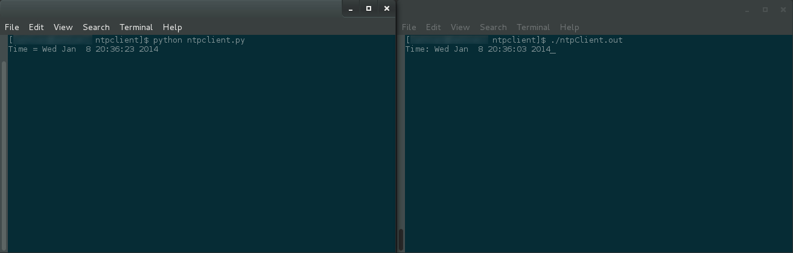

# NTP Client

This NTP client is similar in nature to `ntpdate` but does not accept any command line arguments
nor does it update the system clock. Note that this NTP client does not use any NTP libraries
but rather works directly at the [NTP protocol level](http://tools.ietf.org/html/rfc958).  

Within `./source` there are two versions of the NTP client. One is written in C while the other
one is written in Python. They both have the same functionality and are independent of one another.
The C version uses `us.pool.ntp.org` as the NTP server while the Python version uses `pool.ntp.org`.  

For more information be sure to read
[Let's make a NTP Client in C](https://lettier.github.io/posts/2016-04-26-lets-make-a-ntp-client-in-c.html).

_(C) 2014 David Lettier._  
http://www.lettier.com/

## License

See [LICENSE](LICENSE).
